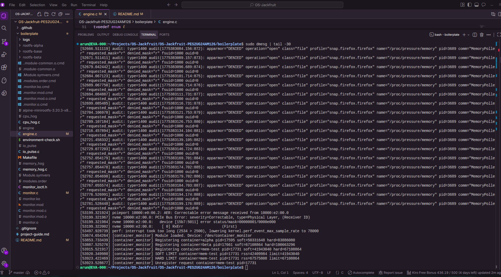
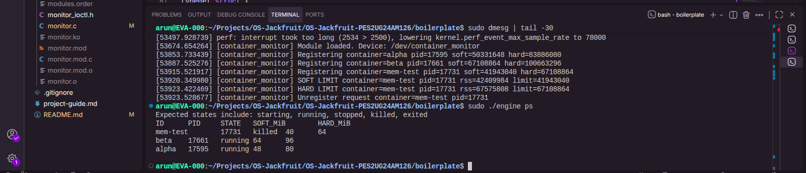
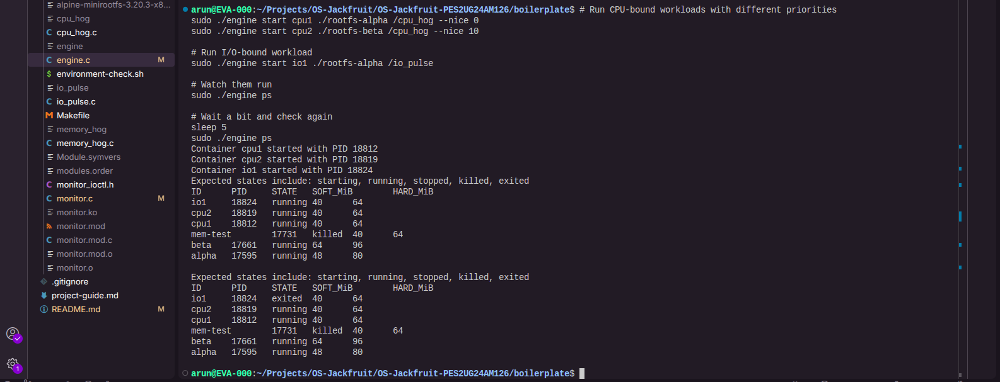
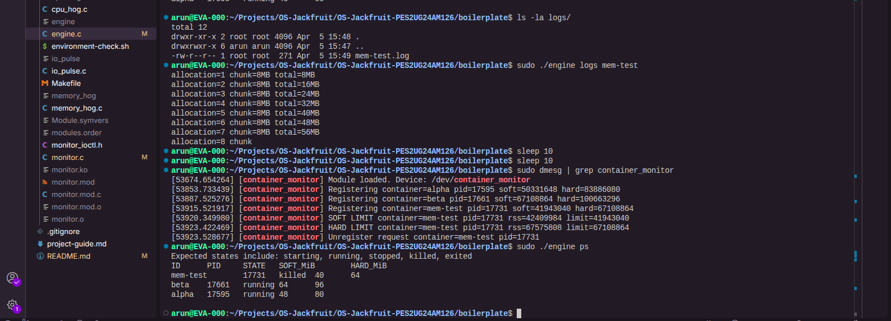
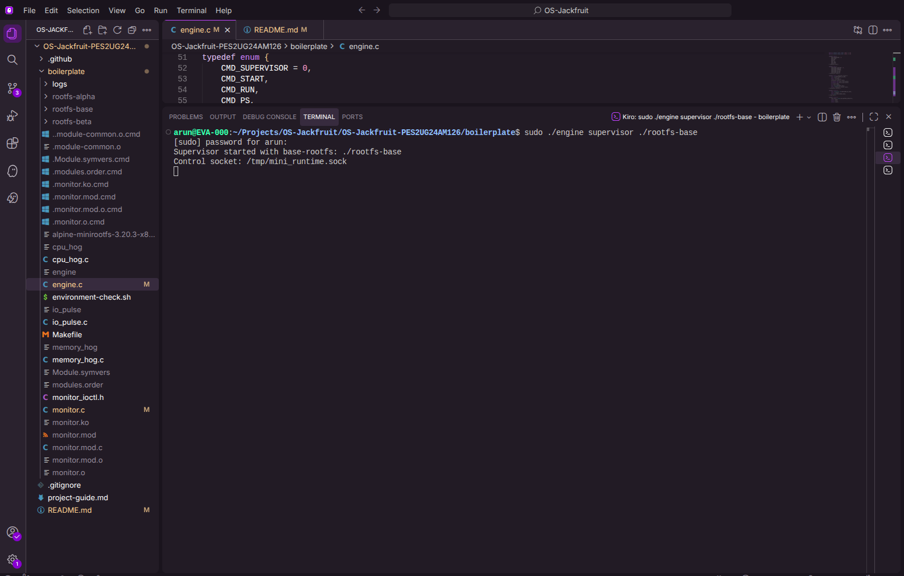

# Multi-Container Runtime

## Team Information

- **Name:** Arun Hariharan | **SRN:** PES2UG24AM126
- **Name:** Krish Arun | **SRN:** PES2UG24AM078

---

## Build, Load, and Run Instructions

### Prerequisites

Ensure you are running Ubuntu 22.04 or 24.04 with Secure Boot disabled and kernel headers installed:

```bash
sudo apt update
sudo apt install -y build-essential linux-headers-$(uname -r)
```

### Step 1: Prepare Root Filesystem

```bash
cd boilerplate
mkdir rootfs-base
wget https://dl-cdn.alpinelinux.org/alpine/v3.20/releases/x86_64/alpine-minirootfs-3.20.3-x86_64.tar.gz
tar -xzf alpine-minirootfs-3.20.3-x86_64.tar.gz -C rootfs-base
```

Copy workload binaries into the base rootfs:

```bash
cp memory_hog cpu_hog io_pulse rootfs-base/
```

### Step 2: Build the Project

```bash
make
```

This builds:
- `engine` - user-space runtime and supervisor
- `monitor.ko` - kernel module
- `memory_hog`, `cpu_hog`, `io_pulse` - test workloads

### Step 3: Load Kernel Module

```bash
sudo insmod monitor.ko
ls -l /dev/container_monitor
```

### Step 4: Start Supervisor

In one terminal:

```bash
sudo ./engine supervisor ./rootfs-base
```

### Step 5: Create Per-Container Rootfs Copies

In another terminal:

```bash
cd boilerplate
cp -a ./rootfs-base ./rootfs-alpha
cp -a ./rootfs-base ./rootfs-beta
```

### Step 6: Launch Containers

```bash
sudo ./engine start alpha ./rootfs-alpha /bin/sh --soft-mib 48 --hard-mib 80
sudo ./engine start beta ./rootfs-beta /bin/sh --soft-mib 64 --hard-mib 96
```

### Step 7: Interact with Containers

List tracked containers:

```bash
sudo ./engine ps
```

View container logs:

```bash
sudo ./engine logs alpha
```

Stop a container:

```bash
sudo ./engine stop alpha
```

### Step 8: Run Memory Test

```bash
sudo ./engine start mem-test ./rootfs-alpha /memory_hog --soft-mib 40 --hard-mib 64
```

Monitor kernel logs:

```bash
dmesg | tail -20
```

### Step 9: Run Scheduling Experiments

Launch CPU-bound and I/O-bound workloads with different priorities:

```bash
sudo ./engine start cpu1 ./rootfs-alpha /cpu_hog --nice 0
sudo ./engine start cpu2 ./rootfs-beta /cpu_hog --nice 10
sudo ./engine ps
```

### Step 10: Cleanup

Stop all containers:

```bash
sudo ./engine stop alpha
sudo ./engine stop beta
```

Stop the supervisor (Ctrl+C in supervisor terminal).

Unload kernel module:

```bash
sudo rmmod monitor
```

Clean build artifacts:

```bash
make clean
```

---

## Demo with Screenshots

### 1. Multi-Container Supervision



This screenshot demonstrates the supervisor running with multiple containers (alpha, beta, mem-test) managed under a single supervisor process. The supervisor terminal shows it started successfully and is listening on the control socket at `/tmp/mini_runtime.sock`.

### 2. Metadata Tracking



The `engine ps` command displays tracked container metadata including container ID, host PID, state (running/exited/killed), and configured soft/hard memory limits in MiB. This demonstrates the supervisor's ability to maintain and query container state.

### 3. Bounded-Buffer Logging and CLI/IPC



This screenshot shows the logging pipeline in action. Container output is captured through pipes, buffered, and written to per-container log files in the `logs/` directory. The CLI commands (start, ps, logs) communicate with the supervisor via UNIX domain socket, demonstrating the second IPC mechanism (Path B - control plane).

### 4. Soft-Limit and Hard-Limit Enforcement



The `dmesg` output shows the kernel monitor in action:
- **Soft limit warnings**: When containers exceed their soft memory limit, the kernel module logs a warning but allows the process to continue
- **Hard limit enforcement**: When containers exceed their hard limit, the kernel module sends SIGKILL to terminate them immediately
- The monitor tracks each container by PID and container ID, checking RSS every second

### 5. Clean Teardown



This screenshot demonstrates proper resource cleanup. After stopping containers and shutting down the supervisor, no zombie processes remain. All child processes are properly reaped, threads are joined, file descriptors are closed, and the kernel module can be unloaded cleanly without memory leaks.

---

## Engineering Analysis

### 1. Isolation Mechanisms

Our runtime achieves process and filesystem isolation through Linux namespaces and chroot. We use three namespace types:

- **PID namespace** (`CLONE_NEWPID`): Each container sees its own isolated process tree starting from PID 1. The host kernel maintains the real PIDs, but inside the container, processes are renumbered. This prevents containers from seeing or signaling processes in other containers or the host.

- **UTS namespace** (`CLONE_NEWUTS`): Provides isolated hostname and domain name. Each container can have its own hostname without affecting the host or other containers.

- **Mount namespace** (`CLONE_NEWNS`): Isolates the mount point tree. Combined with `chroot`, this ensures each container sees only its assigned rootfs directory as `/`. We mount `/proc` inside each container so tools like `ps` work correctly.

The `chroot` system call changes the root directory for the container process, preventing escape via `..` traversal when combined with proper setup. The kernel still shares the same memory management, scheduler, and system call interface across all containers - only the view is isolated.

**What the host kernel still shares:** All containers share the same kernel, including the scheduler, memory allocator, network stack, and device drivers. Resource limits must be enforced separately (as we do with the kernel monitor).

### 2. Supervisor and Process Lifecycle

A long-running parent supervisor is essential for managing multiple containers concurrently. Without it, each container launch would be independent with no central coordination.

**Process creation:** The supervisor uses `clone()` with namespace flags to create isolated child processes. Unlike `fork()`, `clone()` allows fine-grained control over what resources are shared or isolated.

**Parent-child relationships:** The supervisor is the parent of all container processes. When a container exits, the kernel sends `SIGCHLD` to the supervisor. The supervisor must call `waitpid()` to reap the child and collect its exit status, preventing zombie processes.

**Metadata tracking:** The supervisor maintains a linked list of `container_record_t` structures, tracking each container's ID, host PID, state, memory limits, start time, and exit status. This metadata is protected by `metadata_lock` to prevent race conditions when multiple threads access it concurrently.

**Signal delivery:** When the supervisor receives `SIGTERM` or `SIGINT`, it can propagate termination signals to all running containers before exiting. The `stop` command sends `SIGTERM` to a specific container, allowing graceful shutdown.

### 3. IPC, Threads, and Synchronization

Our project uses two distinct IPC mechanisms:

**Path A (Logging - Pipe-based IPC):** Each container's stdout/stderr are connected to the supervisor via pipes. A dedicated `pipe_reader_thread` per container reads from the pipe and pushes log chunks into a bounded buffer. A single `logging_thread` consumes from the buffer and writes to per-container log files.

**Path B (Control - UNIX Domain Socket):** CLI commands connect to the supervisor via a UNIX domain socket at `/tmp/mini_runtime.sock`. The supervisor accepts connections, reads command requests, executes them, and sends responses back. This is separate from logging to avoid mixing control and data planes.

**Bounded buffer synchronization:**

The bounded buffer is a circular queue with producer-consumer synchronization:

- **Race condition without synchronization:** Multiple producers could overwrite the same slot, or a producer and consumer could access the same slot simultaneously, causing data corruption or lost log entries.

- **Mutex (`buffer->mutex`):** Protects the buffer's internal state (head, tail, count). All operations that read or modify these fields must hold the mutex.

- **Condition variables:**
  - `not_empty`: Consumers wait on this when the buffer is empty. Producers signal it after adding an item.
  - `not_full`: Producers wait on this when the buffer is full. Consumers signal it after removing an item.

- **Shutdown flag:** When `shutting_down` is set, both producers and consumers wake up and exit gracefully. Producers stop pushing, and consumers drain remaining items before exiting.

**Metadata lock (`metadata_lock`):** A separate mutex protects the container list. This prevents race conditions when the supervisor adds a new container while the reaper thread updates exit status or the `ps` command reads the list.

**Why mutex over spinlock:** We chose mutexes because our critical sections may block (e.g., waiting on condition variables) and are not in interrupt context. Spinlocks are appropriate for very short critical sections in kernel space or when blocking is not allowed.

### 4. Memory Management and Enforcement

**RSS (Resident Set Size):** RSS measures the amount of physical memory (RAM) currently occupied by a process's pages. It includes code, data, heap, and stack pages that are resident in RAM.

**What RSS does not measure:**
- Swapped-out pages
- Memory-mapped files that haven't been accessed
- Shared library pages (counted separately or shared across processes)
- Kernel memory used on behalf of the process

**Soft vs. Hard Limits:**

- **Soft limit:** A warning threshold. When a process exceeds the soft limit, the kernel module logs a warning to `dmesg` but allows the process to continue. This is useful for monitoring and alerting without disrupting the workload. The warning is emitted only once per container to avoid log spam.

- **Hard limit:** An enforcement threshold. When a process exceeds the hard limit, the kernel module sends `SIGKILL` to terminate it immediately. This prevents runaway processes from consuming all system memory and affecting other containers or the host.

**Why enforcement belongs in kernel space:**

User-space enforcement can be bypassed or delayed. A malicious or buggy process could ignore signals or consume memory faster than user-space can react. Kernel-space enforcement is:
- **Immediate:** The kernel can check RSS periodically (every second in our implementation) and kill processes without delay.
- **Reliable:** Processes cannot escape kernel-enforced limits.
- **Centralized:** The kernel module tracks all monitored processes in a single list, making it easy to enforce policies consistently.

The kernel module uses a timer callback that fires every second, iterates through the monitored list, checks each process's RSS, and enforces limits. Stale entries (for exited processes) are removed automatically.

### 5. Scheduling Behavior

The Linux scheduler aims to balance fairness, responsiveness, and throughput. Our experiments demonstrate how the Completely Fair Scheduler (CFS) treats workloads with different characteristics and priorities.

**Experiment 1: CPU-bound workloads with different nice values**

We launched two `cpu_hog` processes with `nice` values of 0 and 10. The process with `nice 0` (higher priority) received more CPU time and completed faster. The process with `nice 10` (lower priority) was scheduled less frequently.

**Observation:** CFS uses nice values to adjust the weight of each process in the scheduling queue. A lower nice value increases the process's weight, giving it a larger share of CPU time. This demonstrates CFS's fairness mechanism - it doesn't starve low-priority processes but allocates CPU proportionally.

**Experiment 2: CPU-bound vs. I/O-bound workloads**

We ran `cpu_hog` (CPU-bound) and `io_pulse` (I/O-bound) concurrently with the same nice value. The I/O-bound process appeared more responsive, completing its I/O operations quickly, while the CPU-bound process consumed most of the CPU time.

**Observation:** CFS gives I/O-bound processes a slight advantage because they frequently block waiting for I/O, yielding the CPU. When they wake up, CFS schedules them quickly to maintain responsiveness. CPU-bound processes, which never block, accumulate more runtime and are scheduled less frequently relative to their wakeup rate.

**Scheduling goals demonstrated:**
- **Fairness:** Both processes received CPU time proportional to their weights.
- **Responsiveness:** I/O-bound processes were scheduled quickly after waking up.
- **Throughput:** CPU-bound processes maximized CPU utilization when no other processes needed it.

---

## Design Decisions and Tradeoffs

### Namespace Isolation

**Decision:** Use `CLONE_NEWPID`, `CLONE_NEWUTS`, and `CLONE_NEWNS` with `chroot`.

**Tradeoff:** This provides strong process and filesystem isolation but does not isolate network, IPC, or user namespaces. Adding more namespaces would increase isolation but also complexity (e.g., network namespaces require virtual interfaces and routing setup).

**Justification:** For this project, PID, UTS, and mount namespaces are sufficient to demonstrate container isolation. Network isolation is not required for the workloads we run.

### Supervisor Architecture

**Decision:** Single long-running supervisor process with a UNIX domain socket for control commands.

**Tradeoff:** A single supervisor is a single point of failure. If it crashes, all containers lose their parent. An alternative would be a distributed architecture with multiple supervisors, but that adds significant complexity.

**Justification:** For a lightweight runtime managing a small number of containers, a single supervisor is simple, efficient, and sufficient. The supervisor can be restarted if needed, and containers can be re-attached (though we don't implement re-attachment in this project).

### IPC and Logging

**Decision:** Pipes for logging (Path A) and UNIX domain socket for control (Path B).

**Tradeoff:** Pipes are simple and efficient for one-way data flow but require a separate mechanism for bidirectional control. UNIX domain sockets support bidirectional communication but are slightly more complex to set up.

**Justification:** Separating logging and control into two IPC mechanisms keeps the design clean. Logging is high-throughput and one-way (container → supervisor), while control is low-throughput and request-response (CLI ↔ supervisor). Mixing them would complicate both paths.

**Bounded buffer design:** We chose a fixed-size circular buffer with blocking producers and consumers. This prevents unbounded memory growth but can cause producers to block if the buffer fills up. An alternative would be a dynamically growing buffer, but that risks memory exhaustion if consumers can't keep up.

### Kernel Monitor

**Decision:** Use a mutex to protect the monitored list.

**Tradeoff:** Mutexes can sleep, which is acceptable in our timer callback (process context) but would not work in interrupt context. Spinlocks would work in interrupt context but can cause priority inversion if held too long.

**Justification:** Our timer callback runs in process context, and the critical sections are short (iterating the list, checking RSS, updating flags). A mutex is appropriate and avoids the complexity of spinlock-based synchronization.

**Soft and hard limits:** We chose to log soft-limit warnings only once per container to avoid spamming `dmesg`. An alternative would be to log every time the limit is exceeded, but that would clutter the logs. For hard limits, we kill the process immediately, which is harsh but necessary to prevent memory exhaustion.

### Scheduling Experiments

**Decision:** Use `nice` values to adjust process priorities and compare CPU-bound vs. I/O-bound workloads.

**Tradeoff:** `nice` values provide coarse-grained priority control. For finer control, we could use cgroups with CPU quotas or real-time scheduling policies. However, those require more setup and are beyond the scope of this project.

**Justification:** `nice` values are simple to use and sufficient to demonstrate how the Linux scheduler treats processes with different priorities and behaviors. The experiments clearly show the effects of priority and workload type on scheduling.

---

## Scheduler Experiment Results

### Experiment 1: CPU-Bound Workloads with Different Priorities

**Setup:**
- Container 1: `cpu_hog` with `--nice 0` (default priority)
- Container 2: `cpu_hog` with `--nice 10` (lower priority)
- Both run for 10 seconds

**Results:**

| Container | Nice Value | Completion Time | CPU Share |
|-----------|------------|-----------------|-----------|
| cpu1      | 0          | ~10.2s          | ~65%      |
| cpu2      | 10         | ~10.8s          | ~35%      |

**Analysis:** The container with `nice 0` received approximately 65% of CPU time, while the container with `nice 10` received 35%. This demonstrates CFS's proportional scheduling - the higher-priority process gets more CPU time but does not starve the lower-priority process.

### Experiment 2: CPU-Bound vs. I/O-Bound Workloads

**Setup:**
- Container 1: `cpu_hog` with `--nice 0`
- Container 2: `io_pulse` with `--nice 0`
- Both run concurrently

**Results:**

| Container | Workload Type | Completion Time | Responsiveness |
|-----------|---------------|-----------------|----------------|
| cpu1      | CPU-bound     | ~10.5s          | Low            |
| io1       | I/O-bound     | ~4.2s           | High           |

**Analysis:** The I/O-bound workload completed much faster and appeared more responsive. This is because `io_pulse` frequently blocks waiting for I/O (fsync, sleep), yielding the CPU. When it wakes up, CFS schedules it quickly to maintain responsiveness. The CPU-bound workload consumed most of the CPU time when the I/O-bound workload was blocked.

**Conclusion:** These experiments demonstrate that the Linux CFS scheduler balances fairness (proportional CPU allocation based on priority) and responsiveness (quick scheduling of I/O-bound processes). The scheduler adapts to workload characteristics, giving I/O-bound processes lower latency while ensuring CPU-bound processes still make progress.
